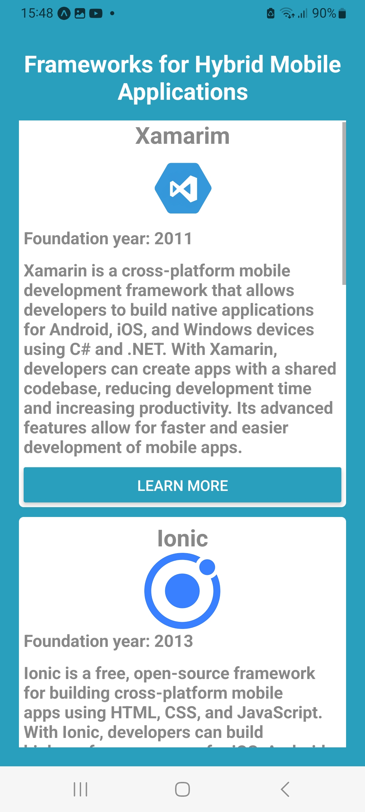

# desenvolsimento web cliente 1

Este aplicativo foi desenvolvido como parte da atividade da matéria de Desenvolvimento Web Cliente, do curso de Sistemas Para Internet da UAM. 

Este aplicativo possui uma breve descrição de 6 frameworks para op desenvolvimento de aplicativos mobile hibridos. 



Para rodar o aplicativo no seu celular você pode baixar o repositório no seu computador e rodar os seguintes comando:

```
npm install
npx start expo
```

Será necessário que você baixe o Expo GO no seu celular e com o aplicativo aberto, basta escanear o QR code gerado pelo comando 

```
npx start expo
```